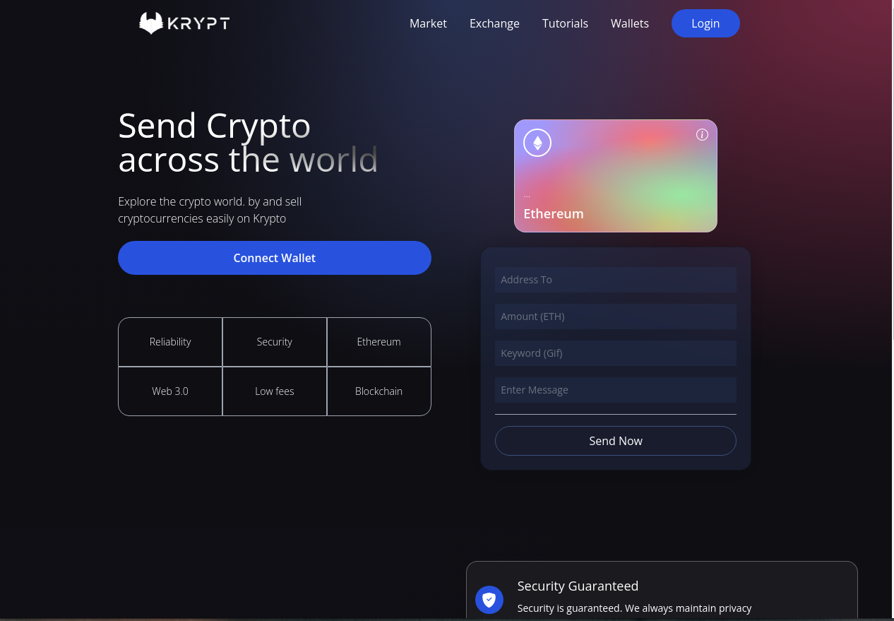

  
  <h1>Kypto</h1>
  
  

    Project based on the content of the <strong>JavaScript Mastery</strong> channel on youtube
  

  [JavaScript Mastery](https://www.typescriptlang.org)
   
  

    
  

   

  <h2>Tecnologias :rocket: </h2>

- [ReactJS](https://reactjs.org/)
- [Typescript](https://www.typescriptlang.org)
- [tailwind](https://tailwindcss.com/)

  <strong>OBS: <strong>this project needs the contract to do the transactions using metamask,
  hardhat lib was used to generate

- [hardhat](https://hardhat.org/)

---
Made with ♥ by Lucas Aguiar :wave: [Get in touch!](https://www.linkedin.com/in/lucasaguiiar)
